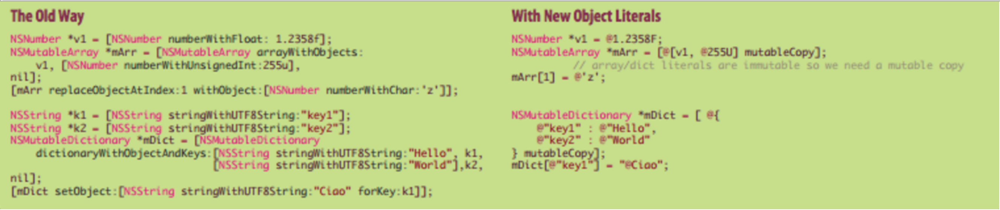

####2017.02.08 - #20 (5주차 3번째 수업)

#자료구조

##포인터 pointer
###Memory구조  

###Pointer  

##Value & Reference  

###구조체 struct  

###typedef 별명 짓기  
```objc
typedef <데이터타입> <이름>;
```

###구조체 vs 클래스


##배열 array  
###Array  

###Linked List   

###NSArray  

###NSMutableArray  

###Dictionary


##영화 json 데이터 구조 만들어보기
```objc
// 서버로부터 데이터를 앱이 받는 상황이라 가정

{ "영화id" : int,
  "제목"   : {"국문" : str,
             "영문" :str },
  "개요"   : { "장르"     : [str, str, ...],
              "제작국가"  : [str, ...],
              "플레이타임" : int,
              "국내개봉일" : str,
              "국내등급"  : int }, 
  "줄거리" : str,
  "참여" : { "감독"   : [str, str, ...],
            "출연진" : { "주연" : [str, str, ...],
                       "조연" : [str, str, ...] },
            "제작사" : str,
            "배급사" : str },
  "미디어" : {"포스터" : [str, str, ...],
            "스틸컷" : [str, str, ...],
            "영상"   : [str, str, ...] },
  "평가"   : {"전체평점" : {"평론가평점" : float,
                         "평론평가수 : int, 
                         "관객평점"   : float,
                         "관객평가수" : int },
             "평론가"  : [{"사용자id" : int, "평점" : float, "리뷰" : str }, 
                        {"사용자id" : int, "평점" : float, "리뷰" : str },
                        ...],
             "관객"   : [{"사용자id" : int, "평점" : float, "리뷰" : str }, 
                        {"사용자id" : int, "평점" : float, "리뷰" : str },
                        ...]
}
```

##과제
###Literal문법 알아보기
리터럴이란, 소스 코드의 고정된 값을 대표하는 용어다. 거의 모든 프로그래밍 언어는 정수, 부동소수점 숫자, 문자열, 불린 자료형과 같은 용어를 가지고 있다. 어떤 언어는 열거 타입이나, 배열 자료형, 객체와 같은 용어도 있다.


 
리터럴이란, **컴파일시 프로그램 내에 정의되어 있는 그대로 정확히 해석되어야 할 값**을 의미한다. 이에 비해, 변수란 프로그램의 실행 중에 상황에 따라 다른 값들을 표현할 수 있으며, 상수는 프로그램 실행 중 늘 같은 값을 표현한다. 그러나 리터럴은 명칭이 아니라, 값 그 자체이다. 예를 들어 아래의 수식에서 "x"는 변수이며 "7"은 리터럴이다.

```x = 7```

리터럴은 숫자 뿐 아니라, 문자 또는 문자열일 수 있다.

또한, 리터럴 문법이란 이러한 리터럴 값들을 간결히 사용할 수 있게 미리 정의된 문법이다.

  

#####리터럴 참고자료
1. [위키백과 - "리터럴"](https://ko.wikipedia.org/wiki/%EB%A6%AC%ED%84%B0%EB%9F%B4)  
2. [텀즈 - "리터럴" ](http://www.terms.co.kr/literal.htm)  
3. [블로그 - "Objective-C 리터럴(Literal) 문법"](http://blog.naver.com/PostView.nhn?blogId=itperson&logNo=220822481437&redirect=Dlog&widgetTypeCall=true)  


###JSON 알아보기
JSON(JavaScript Object Notation)은 속성-값 쌍으로 이루어진 데이터 오브젝트를 전달하기 위해 인간이 읽을 수 있는 텍스트를 사용하는 개방형 표준 포맷이다. 특히, 인터넷에서 자료를 주고 받을 때 그 자료를 표현하는 방법으로 알려져 있다. 자료의 종류에 큰 제한은 없으며, 특히 컴퓨터 프로그램의 변수값을 표현하는 데 적합하다.

본래는 자바스크립트 언어로부터 파생되어 자바스크립트의 구문 형식을 따르지만 언어 독립형 데이터 포맷이다. 즉, 프로그래밍 언어나 플랫폼에 독립적이므로, 구문 분석 및 JSON 데이터 생성을 위한 코드는 C, C++, C#, 자바, 자바스크립트, 펄, 파이썬 등 수많은 프로그래밍 언어에서 쉽게 이용할 수 있다.

```json
{
    "이름": "최제헌",
    "나이": 26,
    "성별": "남",
    "주소": "경기도 광명"
}
```


#####JSON 참고자료  
1. [위키백과 - "JSON"](https://ko.wikipedia.org/wiki/JSON)  
2. [JSON - "JSON" ](http://www.json.org/json-ko.html)  