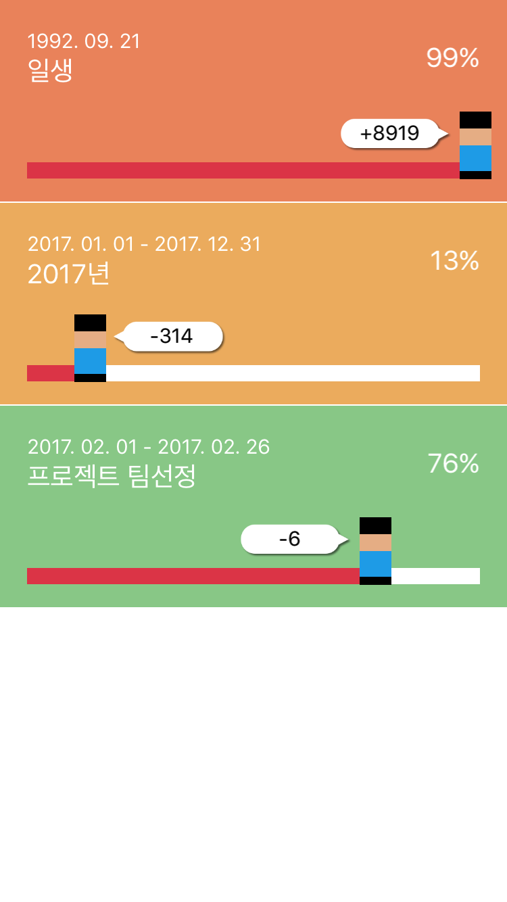
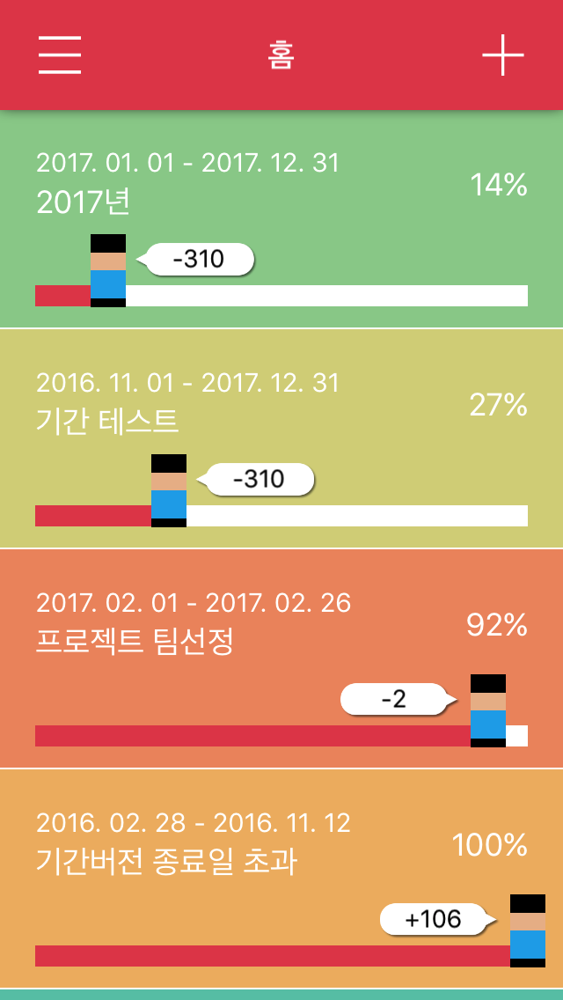
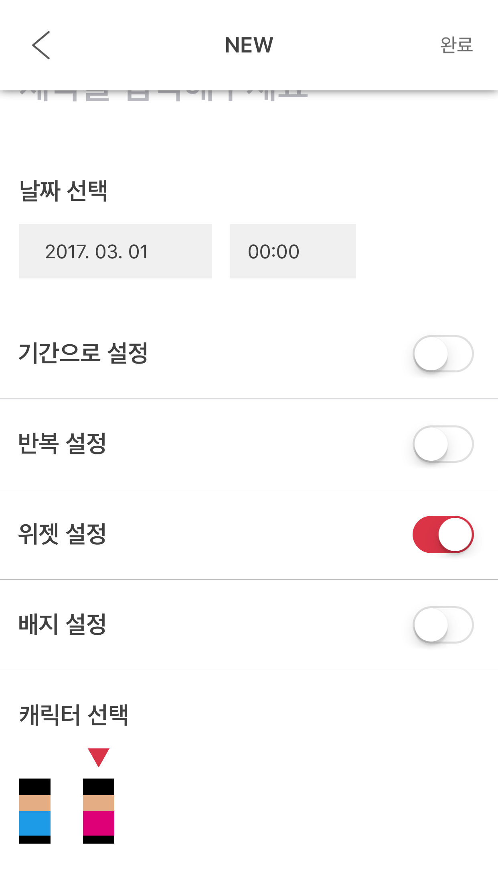

####2017.02.19 - 과제

## UITableView 과제
### AT - Countdown reminder [-> 링크](https://itunes.apple.com/app/id976019182)   
  

### AT Copy
#### 2017.02.19  
    
  
#### 2017.02.24  
    
  
#### 2017.03.01  
  
##### 업데이트 내용  
- AddTableViewCell 제작
- AddTableViewCell 불러오는 방식 재구성  
- 모든 폰 해상도에 맞게 프레임, 레이아웃 수정 (캐릭터, 말풍선, 날짜입력창)  
- AddMenu TableViewCell 계속 생성되는 버그 수정  

##### 미해결  
- 애니메이션 문제 (중복으로 불러야 시작 됨..?!)  
- Plain Style UITableView에서의 Separator 설정 문제  
- 커스텀테이블뷰셀 사용시, 기존 테이블뷰셀의 textFiled, accessoryView 사용이 안됨  

#### 2017.03.02  
  
##### 업데이트 내용   
- StatusCharacter 클래스 재구성

